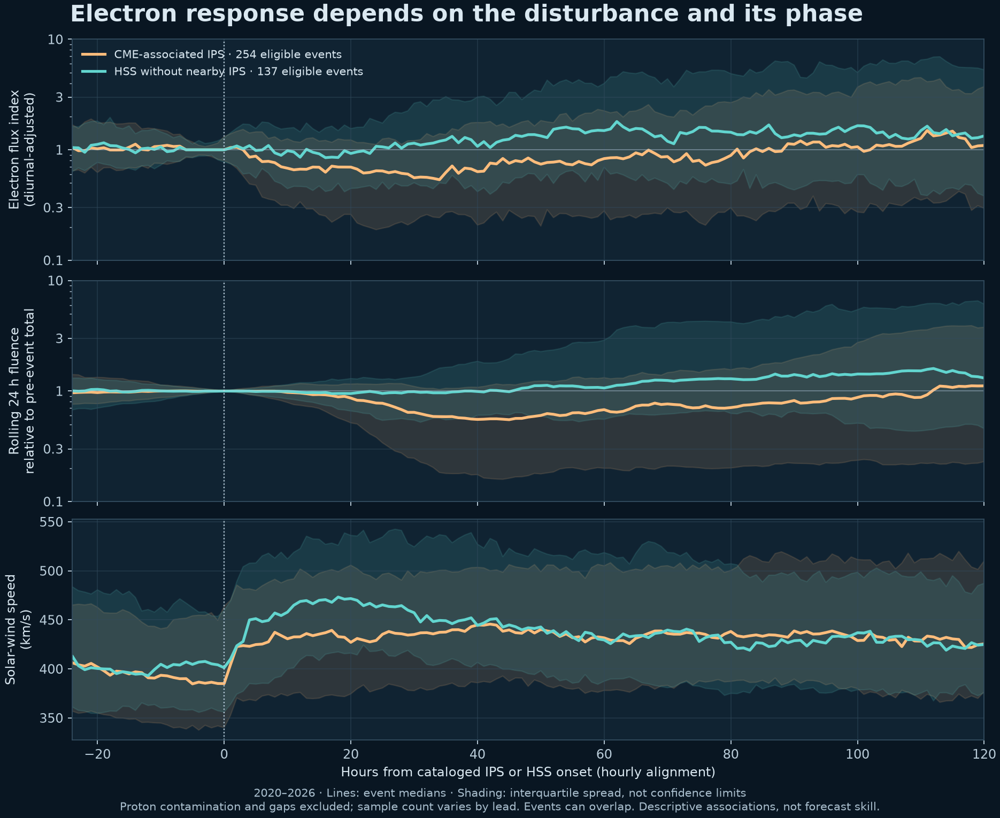

# WXF experimental rolling electron fluence

**The office criteria are 1.1e8 and 4.8e8 electrons cm⁻² sr⁻¹ in the preceding rolling 24 hours. The obsolete 5.8e8 trigger is removed.** The earlier removal of 4.8e8 was a mistake and is corrected. These screen accumulated exposure relevant to internal charging; they are not universal spacecraft-damage thresholds. User Alert Settings still control plot styling; unrelated custom settings are retained.

**Current WXF (v0.1) remains the default. WXF-EF-0.3 is a live shadow candidate with CME-arrival, IPS/HSS-event phase and solar-wind discriminators.** It is selectable in the Electron Forecast card, and both numerical forecasts are preserved per issue. The initial v0.2 candidate failed its prespecified range-coverage gate. A broader five-fold chronological historical test now supplies statistical evidence: it supports skill over persistence, but does not establish added CME/HSS skill over measured drivers. Live verification complements historical testing; it is not the only valid form of verification. No percentage-growth method is used.

## What the new candidate adds

| Input | Candidate use | Qualification |
|---|---|---|
| >2 MeV electron observations | Recent levels, variability and changes; 7-day diurnal shape | The seven days estimate 24/12-hour harmonics, not the entire forecast |
| Measured L1 wind | Speed, density, Bt/Bz, rectified VBs, proton pressure; recent changes, variability, peaks and forcing history to 14 days | Completed hours plus one-hour latency; pressure omits alpha particles |
| NASA CME Scoreboard | Submission-gated predicted arrivals, windows overlapping the next 12/24/48/72 h and preceding 72 h, provider spread, stated uncertainty and predicted Kp | Predicted Kp is not future observed Kp. Agreement is not an impact probability |
| DONKI IPS and HSS versions | Time since observed shock/HSS onset, reporting delay, known CME association, and diurnal-adjusted electron response already measured since the event | Only versions submitted by the origin are available; later revisions cannot alter an earlier predictor |
| SWPC / NASA WSA–ENLIL | Their numerical arrival submissions on the Scoreboard | One latest submission per agency and CME; ensemble/single runs do not become independent agency votes |
| HUXt | Now run locally using the SWPC ambient boundary and DONKI cone analyses; numerical Earth wind-speed series displayed and archived | New forward series is context until paired historical runs can support training/verification. Scoreboard HUXt arrivals remain eligible when present |
| 27-day wind recurrence | Earlier-rotation daily speed at the analogous current and next three days; expected rise and coverage | An uncertain HSS-related recurrence proxy; it cannot foresee CH evolution or a new CME |
| New WXF CH/HSS geometry | Recorded with every forecast for future calibration | Not a learned numerical input yet: a consistent history of this detector and its issued forecasts does not exist |
| SWPC three-day bulletin | Preserved as issued, for future forecast-conditioned calibration | Context only; prose is not silently converted into training predictors |

Scoreboard forecast features **never read actual arrival time, actual peak Kp, closeout/miss labels, arrival errors, or post-event notes**. The separate DONKI observation channel legitimately uses an observed IPS/HSS time after that version has been submitted. It also retains reported associations with specific CMEs. Forecasts submitted after the origin are excluded. Aggregate “Average/Median of all Methods” rows are excluded, and forecasts issued after their predicted arrival or before CME observation are rejected. All events are acquired, including predicted impacts that did not occur, to avoid selecting only successful arrivals. The public API may contain later edits under an earlier submission timestamp; submission gating is necessary but does not prove an immutable as-issued historical record. New raw snapshots and feature records are preserved to address this limitation prospectively.

Storms can produce depletion, followed by recovery or enhancement; sustained high-speed wind can support delayed acceleration. The estimator learns associations between these conditions and subsequent measured changes. It does not impose an automatic storm/HSS “flush,” identify a unique loss mechanism, or claim to know future Bz. Arrival timing alone is insufficient to determine the radiation-belt response.

## Data and quality

The complete acquisition spans **January 2020 through September 2026**, rather than isolated old events. It contains **704,899 five-minute particle records and 56,858 complete accepted hourly electron values**: 44,533 GOES-16 and 12,325 GOES-19 hours. The earlier satellite expands the sampled solar-wind regimes. Spacecraft identity remains a feature; training uses relative log-flux evolution and a locally estimated diurnal reference. Profiles and target windows cannot cross the spacecraft handoff. This is **not an assertion of absolute cross-calibration**. The reported 2026 test is GOES-19; transfer across other instruments or orbits is unvalidated.

Five-minute samples are boxcar averages labelled at interval start. All 12 accepted bins are required for a complete hourly mean, labelled at interval end. Negative or missing flux is never zero. Unknown or ≥10 pfu >10 MeV proton flux masks coincident electron bins as a conservative contamination screen. This does not eliminate every instrument artifact. Profile coverage requires 132 of 168 hours, with at least five days containing 18 valid hours. Recent trend and driver windows have explicit coverage gates. Missing hours do not create a false spacecraft transition.

Pressure and rectified southward coupling are calculated at minute cadence before averaging; each wind hour requires 45 valid minute samples. Long optional lags and recurrence carry coverage flags and use a recent, available wind reference when insufficient, rather than invented future data. The main short driver history remains mandatory. The runtime retrieves 35 days to supply recurrence. No future bow-shock-shifted OMNI observations are used as forecast inputs.

## Event-aligned evidence

The full DONKI IPS/HSS acquisition includes all versions from January 2020 onward. An explicit event study has **254 usable CME-associated shock events** and **137 HSS events without an IPS within 48 hours**. Its pre-event diurnal fit is held fixed through each response window. At +24 h, the median normalized electron-flux index after CME-associated IPS events was **0.65** (243 valid events at that lead). At +72 h after the HSS-only onsets it was **1.44** (136 events). Median rolling-fluence ratios were 0.78 at +24 h for the shock group and 1.25 at +72 h for the HSS group.

These are descriptive associations, not fixed forecast multipliers or proof of causation. Event windows may overlap, strong proton periods are screened out, and coverage varies with lead. The broad interquartile spread shows why a universal “flush” rule would be unreliable. The candidate learns the observed event response and elapsed phase alongside measured wind speed, compression and coupling. Later event labels are used only for this descriptive study, never inserted into forecasts before their submission.



Numerical results and per-lead counts: [event-response.json](event-response.json).

## Method and uncertainty

The fixed multi-output random forest has 192 trees, minimum leaf size 12, maximum depth 14, maximum-feature fraction 0.8 and seed 1989. It predicts 24 hourly log(1 + flux) changes from the recent electron level and diurnal shape. Inverse transforms have a hard zero floor. Whole, once-daily calibration error vectors produce **79 coherent 24-hour flux paths**. Every path is integrated first; only then are its 5th, 50th and 95th percentiles taken. Integrating pointwise flux quantiles would not preserve temporal dependence.

At lead h, rolling fluence retains the final 24−h observed hours and adds h predicted hours, multiplying hourly means by 3,600 seconds. No UTC-midnight reset occurs. A missing observed hour invalidates every total containing it; totals resume when the missing hour ages out. Missing recent observations or stale data withhold the forecast. These are local GEO measurements, not belt-wide density, surface charging, LEO drag, proton SEUs, shielding-adjusted dose, or satellite failure probabilities.

## Evaluation and publication decision

Training: **February 2020–February 2026**, 12,156 eligible three-hourly origins. Calibration: March–May 2026, 590 eligible origins (79 once-daily error paths). Development evaluation: June–August 2026, **456 origins on 67 dates**. Every target must finish before its partition ends. All ablations and the previous frozen WXF are scored on exactly the same eligible origins.

| +24 h forecast | Mean absolute fluence error | RMS log error | Nominal 90% range coverage |
|---|---:|---:|---:|
| Current WXF | 1.673 × 10⁷ | 0.382 | 94.7% |
| Long history + observed drivers | 1.522 × 10⁷ | 0.388 | 86.8% |
| Add 27-day recurrence | 1.540 × 10⁷ | 0.388 | 87.9% |
| Add CME guidance (without recurrence) | 1.528 × 10⁷ | 0.382 | 87.1% |
| Initial v0.2 CME/HSS candidate | 1.572 × 10⁷ | 0.396 | 84.4% |
| v0.3 with reported IPS/HSS phase | 1.569 × 10⁷ | 0.386 | 85.3% |
| Diurnal persistence | 1.810 × 10⁷ | 0.450 | — |

The initial v0.2 comparison is preserved separately in [evaluation-arrivals-v02.json](evaluation-arrivals-v02.json). The current candidate and event-phase results are in [evaluation.json](evaluation.json).

The larger-history observed-driver model reduced mean absolute error about **9.1%** versus current WXF in this cohort. The initial v0.2 combined candidate reduced it about **6.1%**, but its RMS log error was worse than current WXF and its range covered only **84.4%**, below the prespecified 85–95% gate. Adding CME guidance to the recurrence version worsened average error in this development interval. The v0.2 paired weekly-block comparison and regime results are retained in the initial experiment report; no unfavorable ablation is omitted.

The initial v0.2 candidate's daily-mean error improvement over current WXF had a 95% weekly-block bootstrap interval of approximately **−0.55 to +2.76 million** electrons cm⁻² sr⁻¹. It includes no improvement. This bootstrap contains only 13 calendar-week blocks and is not proof of universal skill. Forecast origins and adjacent storm days are correlated. Proton screening and gaps exclude difficult periods; these results do not cover every operational hour.

The subsequent v0.3 candidate has development MAE **1.569 × 10⁷**, about **6.2% lower** than current WXF, with 85.3% coverage at +24 h. Coverage at +12 h remains only 84.4%, and its RMS log error is slightly worse than current WXF. Adding explicit event phase improved the initial combined candidate only modestly.

The September 1–18 check has only **34 usable origins on 7 dates**: v0.3 MAE **1.518 × 10⁷** versus current WXF **3.801 × 10⁷**; candidate range coverage 94.1%. There were no criterion exceedances in its once-daily sample. This small check does not override the failed development gate. At 1.1 × 10⁸, the June–August once-daily sample had **7 exceedances among 67 sampled dates**; adjacent days need not be separate episodes. No threshold-exceedance probabilities are published.

The June–August interval had already been examined during v0.1 development. Initial v0.2 evaluation exposed an excessively strict missing-spacecraft guard; correcting it restored already-masked missing observations without changing the model settings, splits or gate. September is therefore an additional **retrospective check**, not untouched prospective validation. Historical input receipt times and all revisions are unavailable. The experiment supports further evaluation, not a claim that CME/HSS discriminators have already demonstrated reliable additional skill.

## Chronological historical validation (2022–August 2026)

Historical data **can** validate forecast skill with statistical support. The new [fixed test plan](hindcast-plan.json) refits the existing recipe separately for five test periods: 2022, 2023, 2024, 2025 and January–August 2026. Each fold trains only on earlier years, calibrates whole error paths on the following six months, then evaluates later targets. A 24-hour target embargo separates partitions. No model settings were adjusted after inspecting this comparison, and no deployed artifact was replaced. The current feature recipe is refitted on each fold's earlier archive, including GOES-16; these are not historical predictions from today's GOES-19-only frozen model.

There are **8,999 eligible three-hourly forecasts on 1,291 dates** (6,554 GOES-16 / 2,445 GOES-19). The denominator and exclusions are reported: only **66.2%** of scheduled origins satisfy the strict history and future-truth quality gates. This fraction is not operational uptime. Proton contamination, gaps and spacecraft transitions exclude some difficult periods. The 2025 fold includes transfer to GOES-19 before that spacecraft appears in its training data; per-spacecraft results are reported.

| Recipe / baseline | +24 h mean absolute error | RMS log error | Nominal 90% range coverage |
|---|---:|---:|---:|
| Current feature recipe, refitted | 2.087e7 | 0.602 | 88.7% |
| Expanded measured drivers | 2.035e7 | 0.599 | 88.9% |
| Measured drivers + recurrence | 2.048e7 | 0.598 | 88.6% |
| Full IPS/HSS + CME guidance | 2.043e7 | 0.598 | 88.0% |
| Diurnal persistence | 2.290e7 | 0.762 | — |
| Constant-flux persistence | 2.975e7 | 0.942 | — |

The full recipe improves mean absolute error **10.8% versus diurnal persistence**. Paired, fold-stratified seven-day block bootstrap (2,000 resamples) gives an improvement of **2.47e6**, with a **95% interval of 0.97e6–3.93e6** electrons cm⁻² sr⁻¹. A 27-day block sensitivity also stays positive (1.11e6–3.71e6). Whole blocks retain adjacent forecast origins rather than treating storm hours as independent samples.

Against expanded measured drivers, the corresponding improvement is **−8.41e4**, with a seven-day interval of **−4.02e5 to +2.35e5**; the 27-day sensitivity also spans zero. Against the refitted current feature recipe, the interval also spans zero. Thus the test supplies statistical support over persistence, while it does **not** establish extra average skill from the added event/recurrence predictors. Full-guidance interval coverage is 89.2%, 88.5% and 88.0% at +6/+12/+24 hours. Pooled coverage must not conceal the per-year differences, which are retained in the full report.

At the **4.8e8** criterion, the once-per-day sample contains **17 exceedance dates**. The full recipe's median forecast has **11 hits, 6 misses and 9 false alarms**. At **1.1e8**, it has 149 hits, 50 misses and 20 false alarms across 199 exceedance dates. These are dates, not independent storm episodes. The higher-trigger sample is small; the counts do not establish a reliable satellite-failure probability or universal event detection rate.

This is a chronological out-of-sample test of a fixed recipe, using historical archives. Model design had already been informed by other historical analyses, and provider receipt/revision histories are incomplete; the intervals are conditional on that design and archive, not corrected for every prior modeling choice. Historical HUXt speed inputs are absent, so this test cannot validate their future contribution. A live trial adds checks of actual receipt times, revisions, outages and new regimes. It does not invalidate statistically supported historical results.

Full reproducible statistics: [hindcast-evaluation.json](hindcast-evaluation.json). Every paired prediction: [hindcast-predictions.csv.gz](hindcast-predictions.csv.gz). Prediction-table SHA-256 is recorded in the report. Reproduce with:

```sh
python research/electron_fluence/hindcast.py --hourly work/electron-experiment/hourly.csv --arrivals work/electron-arrivals --impacts work/donki-events --output work/electron-hindcast
```

The current publication includes a compact historical summary in the model methods disclosure. The original development reports remain dated records rather than being silently rewritten with the new thresholds or results.

## Dashboard, outages and verification

In Electron Forecast, select **WXF model → Candidate · IPS/HSS + CME · research** to compare the new forecast. Current WXF remains the default and keeps its original trees and calibration errors. Both 1.1e8 and 4.8e8 appear in the default alert rules and satellite-risk policy; 5.8e8 is removed. All electron-fluence plots use scientific-notation ticks, a zero floor and a default 2e8 upper axis, expanding to 1.25 times the highest visible observation or forecast bound when needed. Threshold overlays do not stretch a quiet plot. Flux and fluence have separate physical units; fluence alert bands are never applied to flux. Hover panels are opaque, the y-axis cannot go below zero, and the existing resizing and page-scroll behavior remain intact.

A Scoreboard or DONKI event-feed outage does not remove current WXF. The candidate switches to its separately evaluated observed-driver plus recurrence variant; its mode is visible. Any candidate checksum or calculation failure leaves current WXF available. No model is automatically retuned or promoted.

Hourly publication appends both forecasts, exact feature values, model hashes, provider predictions/submission times, available IPS/HSS versions, CH context, the next 24 hours of the local HUXt series and the contemporaneous SWPC bulletin to `chhss-data/electron-forecast-history.jsonl`. Prior entries are not rewritten. Raw arrival snapshots are also retained in the run artifact. Lead time is measured from the displayed data cutoff. Prospective scoring must require original issue time earlier than valid time, reject stale/contaminated truth, and keep outage hours visible when reporting availability.

## Numerical HUXt run

WXF runs the **unmodified HUXt 5.0.3 core** pinned to upstream commit `4d5b60bedb4b30ad140a8ea4972c4f5396c687ff`. Its MIT license and an unchanged Earth-only subset of the supplied ephemeris are included. The analytic uniform-wind test checks the numerical solver. The plotting/notebook dependencies are unnecessary for this runtime.

The run discovers NOAA NOMADS' current **ambient** `mrid00000000.inputs.tar.gz`, reads `bnd.nc` directly without extracting archive paths, and uses SWPC's processed V1 at the declared inner boundary. This avoids mistaking the raw WSA terminal-speed calibration for the actual Enlil input speed. V1 is converted from m/s to km/s; the boundary's HEEQ+180 longitudes are converted to Carrington longitude at its own `rundate + TIME` epoch. Only a recent, single-time ambient boundary is accepted, so CMEs are not injected twice. No example or constant-wind boundary is substituted if retrieval fails.

The Earth heliographic latitude is used. DONKI's available most-accurate leading-edge analyses provide CME longitude, latitude, speed, half-angle and the crossing time at 21.5 solar radii. Full width is twice the reported half-angle. The crossing time is advanced by the small constant-speed travel time to SWPC's exact boundary radius. HUXt's default cone duration is 8.5 hours with zero added thickness. The simulation starts seven days before issue and runs through five days after issue, separately with and without CMEs. Earth output is interpolated radially using the supplied ephemeris. Pre-issue output is explicitly a **current-input reconstruction**, not a historical forecast or observation.

The **CME | Solar Wind** page now plots these raw numerical ambient and CME-inclusive time series. This reduced-physics run predicts speed, not Bz, electron fluence, or a calibrated arrival probability. The boundary is static and may be up to 72 hours old. Issued runs and their next-day numerical values are archived for empirical testing; using predicted wind as if it were measured wind would require new calibration. This is a working model run, while its direct contribution to the electron forecast remains unvalidated.

## Reproduction

Install [requirements.txt](requirements.txt), then acquire the complete observation interval and Scoreboard interval recorded in [input-manifest.json](input-manifest.json). The latter includes hashes for both raw responses and normalized saved historical snapshots. Endpoint revisions can change a later download.

```sh
python research/electron_fluence/acquire.py --cache work/electron-history --start 2020-01-01 --stop 2026-09-20
python research/electron_fluence/arrivals.py --cache work/electron-arrivals --start 2019-01-01 --stop 2026-09-20
python research/electron_fluence/experiment.py --cache work/electron-history --arrivals work/electron-arrivals --previous-model research/electron_fluence/model.npz --output work/electron-experiment
python research/electron_fluence/experiment_impacts.py --hourly work/electron-experiment/hourly.csv --arrivals work/electron-arrivals --impacts work/donki-events --output work/electron-impact-experiment
python -m unittest discover -s tests -v
node tests/test_dashboard.cjs
python research/electron_fluence/refresh.py --cache work/electron-current --output chhss-data/electron-fluence.json --evidence work/electron-evidence
```

Acquire DONKI IPS/HSS with `impacts.acquire(cache, start, stop)` for each year with `version=ALL`; the exact URLs are in the manifest. `model.py --cache work/electron-history --output work/electron-experiment` can prepare the hourly table after the original experiment creates its model artifact. HUXt runtime dependencies are included in the root `requirements-chhss.txt`; run `huxt_run.py --cache work/huxt --output chhss-data/huxt-forecast.json` to reproduce a new current run.

The initial arrival experiment uses the [prespecified plan](experiment-plan.json) and writes candidate artifacts; it does not replace the published model. [model-manifest.json](model-manifest.json) records the current, candidate and outage-fallback checksums and code/runtime versions. All deployed estimators use non-executable numeric NPZ arrays with `allow_pickle=False`; scikit-learn is needed only for training. Numeric export is checked against the trained estimator on 200 predictor vectors. Tests cover future-data exclusion, submission gating, provider deduplication, spacecraft transitions, recurrence timing, contamination, missing exposure, portable inference, 4.8e8 restoration and 5.8e8 migration and feed-outage behavior.

## Scientific references

- [NOAA GOES electron product](https://www.swpc.noaa.gov/products/goes-electron-flux): local-time effects and proton contamination.
- [GOES MPS-HI processing documentation](https://data.ngdc.noaa.gov/platforms/solar-space-observing-satellites/goes/goes16/l2/docs/GOES-R_SEISS_L2_MPS-HI.ReadMe.pdf): averaging intervals, quality and calibration context. v0.1's September 17 check matched 287 overlapping operational/ISWA bins and the GOES-19 telescope-4 science channel.
- [NASA CME Scoreboard](https://ccmc.gsfc.nasa.gov/scoreboards/cme/earth/) and [Riley et al., arrival-forecast evaluation](https://arxiv.org/abs/1810.07289): issue-time records and uncertainty in operational arrivals. Acknowledge CCMC and contributing forecast providers in any public validation study; review the provider acknowledgment policy before publication.
- [Qian et al., hourly electron forecasting](https://agupubs.onlinelibrary.wiley.com/doi/full/10.1029/2018SW002078) and [PreMevE update](https://arxiv.org/abs/2104.09055): research precedent for electron history and upstream conditions. WXF is a different estimator and inherits no published skill scores.
- [Solar-image HSS forecasting](https://arxiv.org/abs/2410.05068): motivation for testing a consistent history of coronal-hole measurements rather than assigning an unverified coefficient to a new detector.
- [SWPC REFM](https://www.swpc.noaa.gov/products/relativistic-electron-forecast-model): separate daily fluence product; its UTC-day totals are not relabelled rolling totals.

- [HUXt examples supplied by the user](https://github.com/University-of-Reading-Space-Science/HUXt/blob/master/huxt/notebooks/HUXt_examples.ipynb), [HUXt scientific description](https://doi.org/10.3389/fphy.2022.1005621), [NOAA operational inputs](https://nomads.ncep.noaa.gov/pub/data/nccf/com/wsa_enlil/prod/) and [DONKI API documentation](https://ccmc.gsfc.nasa.gov/tools/DONKI/).

- [Hyndman and Athanasopoulos, time-series cross-validation](https://otexts.com/fpp3/tscv.html): rolling-origin evaluation trains on observations preceding each test target.

### Nested prediction plumes

The publication additionally reports `q25`/`q75` and `fluxQ25`/`fluxQ75` from the same whole residual paths used for the existing 5th/50th/95th percentiles. The chart shows central 50% and 90% prediction ranges. These are empirical pointwise ranges, not simultaneous 24-hour coverage guarantees or confidence intervals for a mean. The nominal 50% band's empirical coverage has not been separately scored. Older publications without inner quantiles retain their outer plume; no inner range is manufactured. Median forecasts, trained parameters and residual samples are unchanged. The SWPC bulletin remains archived as evidence but is removed from the user-facing disclosure.
